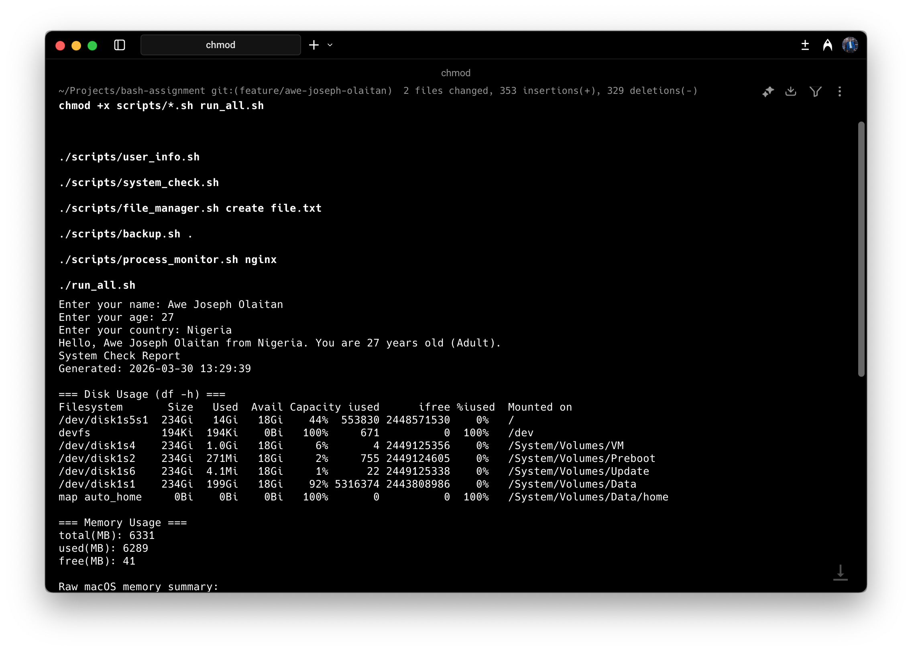
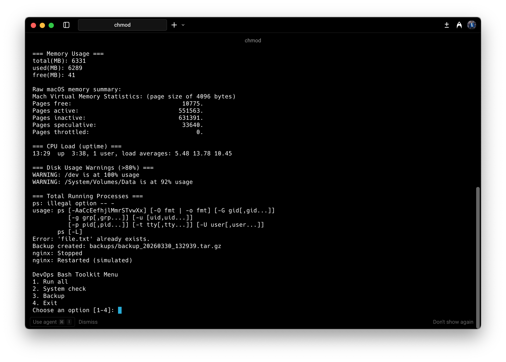
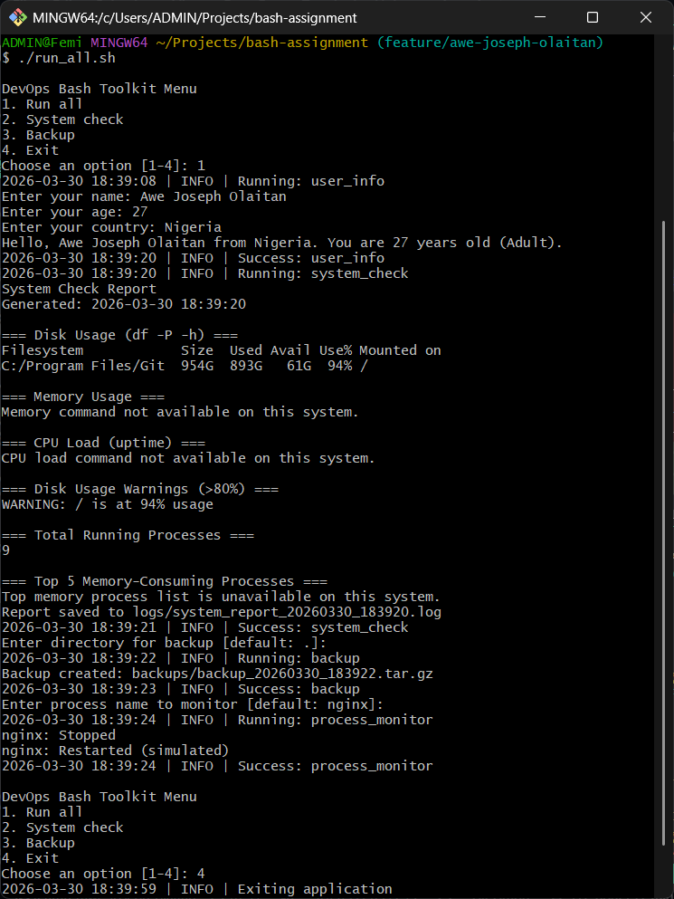

# 🚀 DevOps Bash Toolkit Assessment


---

## 📌 Overview

This repository contains my completed submission for the DevOps Bash Toolkit assessment.

Scope delivered:

- Required scripts (A-D)
- Optional bonus scripts (E-F)
- Logging and basic fault handling
- Cross-platform improvements for Linux, macOS, and Git Bash on Windows

## 📁 Project Structure

```text
bash-assignment/
├── scripts/
│   ├── user_info.sh
│   ├── system_check.sh
│   ├── file_manager.sh
│   ├── backup.sh
│   └── process_monitor.sh
├── run_all.sh
├── logs/
├── backups/
└── README.md
```

## 📊 Implementation Matrix

| Script                       | Status          | Highlights                                                                                                                      |
| ---------------------------- | --------------- | ------------------------------------------------------------------------------------------------------------------------------- |
| `scripts/user_info.sh`       | Completed       | Prompts for name/age/country, validates numeric age, prints age category, logs output                                           |
| `scripts/system_check.sh`    | Completed       | Reports disk/memory/CPU info, warns on high disk usage, counts processes, shows top memory processes, writes timestamped report |
| `scripts/file_manager.sh`    | Completed       | Supports `create`, `delete`, `list`, `rename`, prevents overwrite collisions, logs actions                                      |
| `scripts/backup.sh`          | Completed       | Validates input dir, creates `backup_<timestamp>.tar.gz`, keeps latest 5 backups, logs activity                                 |
| `scripts/process_monitor.sh` | Bonus Completed | Checks service status (`nginx`, `ssh`, `docker`), attempts restart or simulated restart, logs result                            |
| `run_all.sh`                 | Bonus Completed | Interactive menu, runs scripts from `scripts/`, uses `set -euo pipefail`, logs app actions                                      |

---

## ✅ What I Implemented

This repository contains my completed Bash toolkit submission.

Core scripts:

- `scripts/user_info.sh`
- `scripts/system_check.sh`
- `scripts/file_manager.sh`
- `scripts/backup.sh`

Bonus scripts:

- `scripts/process_monitor.sh`
- `run_all.sh`

Key implementation details:

- Input validation and graceful error handling across scripts.
- Consistent logging under `logs/`.
- Backup rotation to keep the latest 5 archives in `backups/`.
- Cross-platform compatibility updates for Linux, macOS, and Git Bash on Windows where possible.

Submission link: [CLICK HERE](https://forms.gle/jrhpKjXsQXZxLopN6)

---

## 🔧 Correct Git Setup (If You Cloned The Source Directly)

If you cloned from the upstream assignment repo instead of your fork, update `origin` to your own GitHub repo URL:

```bash
git remote -v
git remote set-url origin <your-fork-url>
git remote -v
```

Optional: keep the source assignment repo as `upstream` for pulling updates:

```bash
git remote add upstream https://github.com/ts-a-devops/bash-assignment.git
git remote -v
```

Create your feature branch using your name:

```bash
git checkout -b feature/awe-joseph-olaitan
```

Commit message to use:

```bash
git add scripts run_all.sh README.md
git commit -m "feat: complete bash toolkit scripts"
git push -u origin feature/awe-joseph-olaitan
```

---

## ▶️ How To Run (By Platform)

### macOS / Linux

```bash
chmod +x scripts/*.sh run_all.sh
./scripts/user_info.sh
./scripts/system_check.sh
./scripts/file_manager.sh create file.txt
./scripts/backup.sh .
./scripts/process_monitor.sh nginx
./run_all.sh
```

### Windows (PowerShell + Git Bash/WSL installed)

`chmod` is not a PowerShell command. Run scripts through Bash:

```powershell
bash ./scripts/user_info.sh
bash ./scripts/system_check.sh
bash ./scripts/file_manager.sh create file.txt
bash ./scripts/backup.sh .
bash ./scripts/process_monitor.sh nginx
bash ./run_all.sh
```

If `bash` is not available, install one of:

- Git for Windows (Git Bash)
- WSL with Ubuntu

If you get this error in PowerShell:

`execvpe(/bin/bash) failed: No such file or directory`

your `bash` command is pointing to WSL launcher (`C:\Windows\System32\bash.exe`) without a Linux distro. Use Git Bash directly or call Git Bash executable explicitly:

```powershell
$repoPath = ($env:USERPROFILE -replace '\\','/') + "/Projects/bash-assignment"
& "C:\Program Files\Git\bin\bash.exe" -lc "cd \"$repoPath\" && ./scripts/user_info.sh"
& "C:\Program Files\Git\bin\bash.exe" -lc "cd \"$repoPath\" && ./scripts/system_check.sh"
& "C:\Program Files\Git\bin\bash.exe" -lc "cd \"$repoPath\" && ./scripts/file_manager.sh create file.txt"
& "C:\Program Files\Git\bin\bash.exe" -lc "cd \"$repoPath\" && ./scripts/backup.sh ."
& "C:\Program Files\Git\bin\bash.exe" -lc "cd \"$repoPath\" && ./scripts/process_monitor.sh nginx"
& "C:\Program Files\Git\bin\bash.exe" -lc "cd \"$repoPath\" && ./run_all.sh"
```

If running `./scripts/*.sh` opens a new Git Bash window each time, that is a Windows file association behavior for `.sh` files. To keep everything in one terminal session, run inside a Git Bash terminal and execute commands there.

---

## 🛠️ Cross-Platform Fixes Applied

- `system_check.sh`
  - Uses `free -m` on Linux.
  - Falls back to `vm_stat` on macOS.
  - Uses a portable process listing for top memory usage when GNU `ps --sort` is unavailable.

- `backup.sh`
  - Avoids backing up `backups/` and `logs/` into the archive when source is project root.
  - Replaced `mapfile` with a portable cleanup pipeline so it works on macOS default Bash.

---

## 📷 Execution Screenshots

### macOS Log 1



### macOS Log 2



### Windows Log


